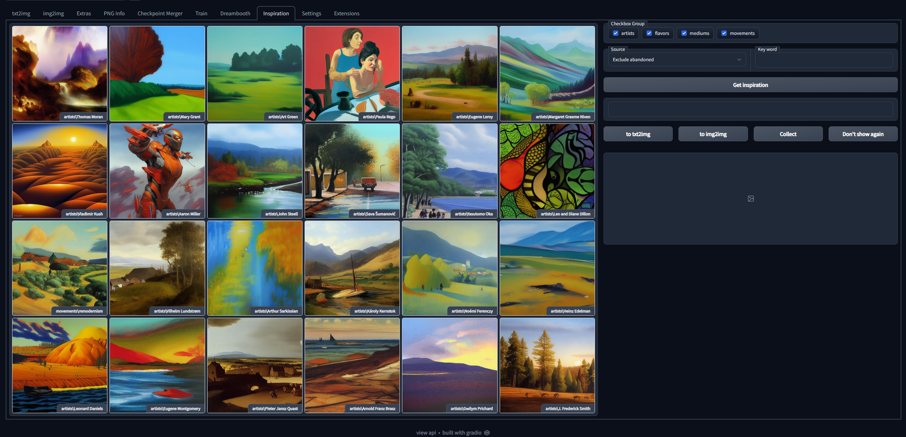
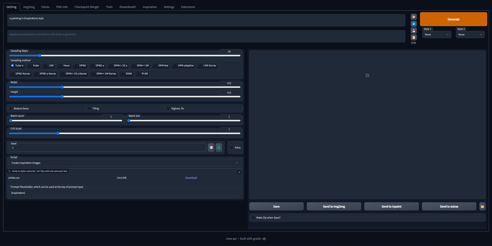

# stable-diffusion-webui-inspiration
This an extension for [stable-diffusion-webui](https://github.com/AUTOMATIC1111/stable-diffusion-webui)

Randomly display pictures of the artist's or artistic genre's typical style. More pictures for this artist or genre are shown after selecting, So you don't have to worry about how hard it is to choose the right art style when you create.

You can filter artists or genre's by keyword, collect the style to favorites, or shield the style you don't like. You can also send the style name to the txt2img or img2img prompt.

All the pictures are created by a script named "Create inspiration images" in the txt2img page and the artist's and genre's names come from the following repository: https://github.com/pharmapsychotic/clip-interrogator/tree/main/data

There are about 6000 artists and art styles in these files. This takes server hours depending on your GPU type and how many pictures you generate for each artist/style.

You can also download generated pictures from the following: https://huggingface.co/datasets/yfszzx/inspiration

## Install
- Go to the directory: \<stable-diffusion-webui project path\>/extensions
- Run this command: `git clone https://github.com/yfszzx/stable-diffusion-webui-inspiration`
- Restart your stable-diffusion-webui, you will see the new tab "Inspiration"

- Run the "Create inspiration images" script inside the "txt2img" page to create images.
- Optionally, you can download the zip file from [here](https://huggingface.co/datasets/yfszzx/inspiration/resolve/main/inspiration.zip) and unzip this file to: \<stable-diffusion-webui project path\>/extensions/stable-diffusion-webui-inspiration
- Restart webui and experience the joy of creation!

 [Look here for more install details](https://github.com/AUTOMATIC1111/stable-diffusion-webui/wiki/Extensions)

## Using txt2img inspiration
- Open the txt2img tab
- At the bottom of Script select "Create inspiration images"
- Upload a text file (e.g. the artist.csv from the root directory)
  - The header "artist,score,category" is ignored
  - If the content is separated by , the first block (everything up to the first ,) is taken
  - If the first block is surrounded by ", the enclosed content will be taken
- Choose a placeholder, the default is {inspiration}
- The placeholder can be used at the top of the prompt e.g. "a painting in {inspiration} style"

